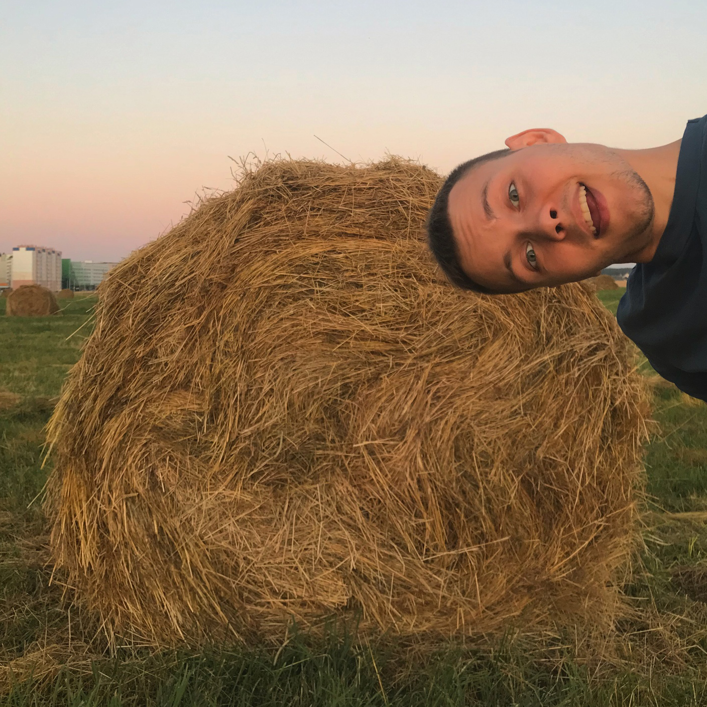

###### Curriculum vitae

---



### **Alex Moore**

_`Front-end developer`_

## **Contact me**

- #### **Location:** _Mogilev, Belarus_
- #### **Phone:** _+375 (33) 636-54-56_
- #### **Email:** *For.Alex.Moore@gmail.com*
- #### **Discord:** _Moore `#2882`_
- #### **LinkedIn:** _[Alex Moore](https://www.linkedin.com/in/alex-moore-593b58234)_

## **About me**

#### The best guy you've ever seen. An initiative person with a desire to learn everything new. I want to become a website developer for people with good taste.

#### Oh yes... I like travel, watch movies, listen to music, active relax and play World of Warcraft.

## **Skills**

- ##### _Javascript_
- ##### _HTML_
- ##### _CSS_
- ##### _Git, GitHub_
- ##### _Figma_
- ##### _Inventor_
- ##### _Photoshop_
- ##### _Premiere Pro_

## **Code example**

```
let doomsday = prompt('Enter Password', '');
alert('Explosion 3..2..1..');
```

## **Education**

**Secondary school №40 and got secondary education** _`2008`_.

**Belarusian-Russian University and got higher education by specialty: Lifting, construction, road machines and equipment** _`2013`_.

**The Rolling Scopes and learning Front-end** _`in progress`_.

## **Languages**

- ##### _Russian `native`_
- ##### _English `A2`_
